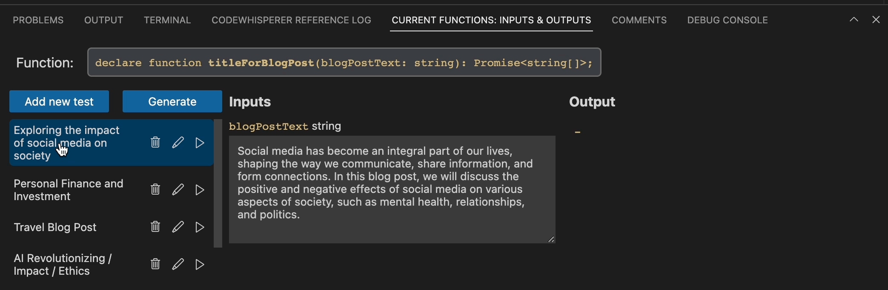
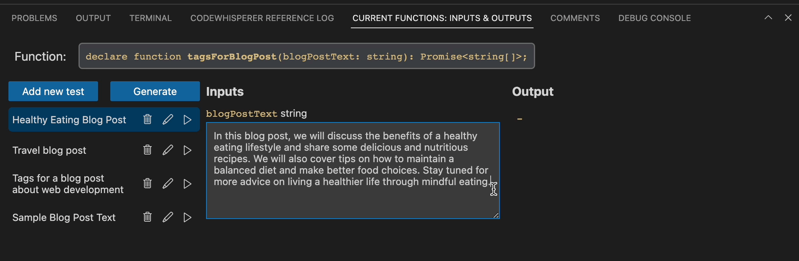
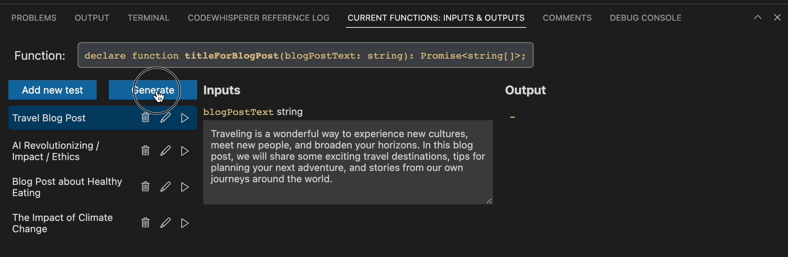

# Imaginary Programming Extension

The Imaginary Programming extension lets you test and iterate on imaginary functions directly from Visual Studio Code. For more information about how to write imaginary functions, check out [imaginary.dev](https://imaginary.dev/).

## Features

To use the Imaginary Programming extension, first navigate to an imaginary function in your code, then pull up the "Current Functions" panel below. From here, you can input new test cases for your imaginary function. Those test inputs will run and show results after you enter them so you can get a sense of how well the imaginary function is written. All of your test cases are saved to a JSON file next to your imaginary function's file, so that the test cases can be saved amongst your team.

As you modify the input parameters or the function itself, you can press the play button off to the right of the test case name to re-run the test case and see how the output changes.

Can't think of a good test case for your imaginary function? Press the "Generate Test Case" button to create new test cases for your function. Note that this button requires access to the GPT-4 API and, because GPT-4 is quite complex, can take a decent amount of time.

## Requirements

You must have an OpenAI API key to use the extension. The first time it is needed by the extension, you will be asked for your API key, and the extension will store it locally. If you don't have an OpenAI API key, [set up an OpenAI account](https://platform.openai.com/signup) and generate a new API key at [your API keys page](https://platform.openai.com/account/api-keys).

In order to use the "Generate Test Case" feature, you must have API access to GPT-4. If you don't have that access yet, you can sign up at [this sign up form](https://openai.com/waitlist/gpt-4-api).

## Issues

PLEASE NOTE: this is an alpha version for testing only; we are still actively fixing bugs in it.

If you find issues or have feedback, please feel free to file them at [https://github.com/imaginary-dev/imaginary-dev].

## Release Notes

### 0.0.2

Fix for small usability bugs.

### 0.0.1

Initial alpha release of the imaginary-dev extension.
